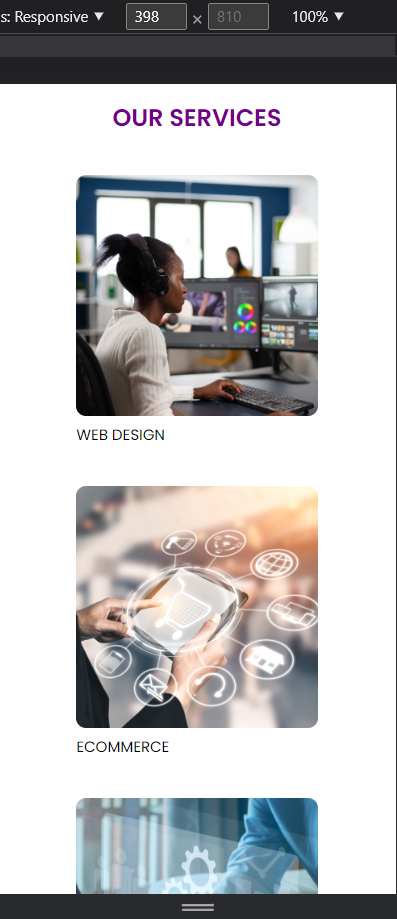

# Simple Agency Landing Page

Agency Landing page made with React.
This is my first Project to learn more about React, using JSX, and using components.

**Link to project** https://brianbud.github.io/simple-landing-page/


## How It's Made:

**Tech used:** REACT

## Initial Set up

After making sure Node.js is installed, I install [Create React App](https://create-react-app.dev/) which I find it amazing that 1 command helps me set up my web app!

To test that it's working, I run the `npm start` command to run the app in the development mode. I could see that the app started in localhost:3000 and it looks like it is running properly and that webpack compiled successfully.

I reset the App.js file to a blank slate to work on it as well as removed any default files such as the following: logo.svg, reportWebVitals.js, setupTests.js, App.test.js, and their imports to keep only the minimum needed files.

I wanted this simple landing page to have 3 sections and with that I created 3 components for those sections:

-HeroSection.js
-ServicesSection.js
-FooterSection.js

## Exporting and Importing

I wanted HeroSection.js, SercicesSection.js, and FooterSection to be in the same level of the component tree but one level deep inside App.js.

To accomplish that, I `export default` each component, and then `import` them in App.js.

**Obstacle** I wanted to write this note to myself because I was taking some time to figure out why my code wasn't working this point.

When `export default FooterSection();` remember that you do not need to call the function; removing `()` made it work!. Also, you have to `return()` some JSX in each component or an error will occur.

## Hero Section

One thing I had to get used to is that React uses `className` over class attribute.

The Hero section consist of a nav with display: flex, a background image where I had to Google to learn how to dim the background image using `linear-gradent` value, and a hero title that is centered.


## Services Section

### Using map() function in React

Something new I learnt is that I could put the variable's date in objects and .map() through them.

`const SERVICE_ BLOCK_DATA = [` I learnt that we use the CONSTANT syntax when not getting from a server but when it's in our code.

The SERVICE_BLOCK_DATA array will have objects with 2 properties, imgURL source and title,

```
const SERVICE_BLOCK_DATA = [
  {
    imgURL: 'https://assets.codepen.io/6060109/agency-service-1.png',
    title: 'Web Design',
  },
  {
    imgURL: 'https://assets.codepen.io/6060109/agency-service-2.png',
    title: 'ecommerce',
  },
  {
    imgURL: 'https://assets.codepen.io/6060109/agency-service-3.png',
    title: 'automation',
  },
];
```

In my JSX, I could write JS code inside `{}` and use the map function `SERVICE_BLOCK_DATA.map()` and return JSX.

```</img>
              <p>{block.title}</p>
```

Now, for each item in the object array, we create a JSX block that replaces the `` and `<p>` variables.

```
 <div class='services-section'>
      <h2>Our Services</h2>
      <div className='services-container'>
        {SERVICE_BLOCK_DATA.map((block) => {
          return (
            <div className='service-block'>
              </img>
              <p>{block.title}</p>
            </div>
          );
        })}
      </div>
    </div>
```


## Footer Section

Since most of it now is working on CSS, I had more practice and learnt something new using CSS attribute selector such as `input[type='email']` as well as connecting it with a psedeudo element at the same time `input[type='email']::placeholder`.


## Mobile Responsive

In the future, I would have prefered to start making websites "Mobile First", nevertheless, this is how I made it Mobile Responsive using media queries.

`@media only screen and (max-width: 400px) {...}`

The 3 divs in the services section were changed with `flex-wrap: wrap`



## Deploying app to Github pages

When deploying this React website to Github pages, it shows the content based on the `README.md`.

I learned that the reason why README.md is being rendered is because I have not generated the browser-friendly static assets(HTML,CSS, JS) needed for the app to run in the browser.

After some research, these are the steps I used to successfully depoy it to Github pages. I am documenting this process for future reference when I want to deploy a React app again.

These are the following steps I used:

In the terminal `npm install gh-pages --save-dev`. This adds "gh-pages" library and it will be seen in `package.json` file under "devDependencies".

In the top of the package.json file I add `"homepage" : "https://{your_github_username}.github.io/{app-name}"`

In the scripts section add these 2 code:

```
    "predeploy": "npm run build",
    "deploy": "gh-pages -d build",
```

In the terminal `npm run build`

In Github > repo settings > pages > and select gh-pages branch.

## Lessons Learned:

I learnt a lot in the project:

- Understanding the Component Tree
- Practice writing JSX
- Using Create-React-App
- Importing and Exporting components
- Using .map() in React

Thank you for reading this!
